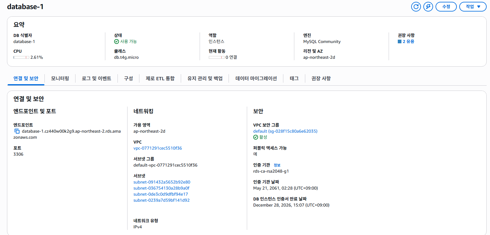
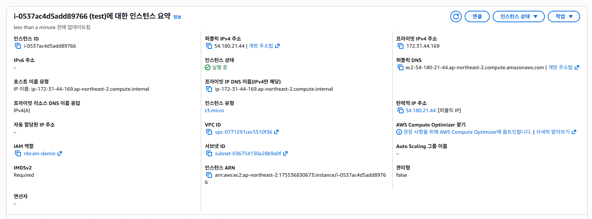
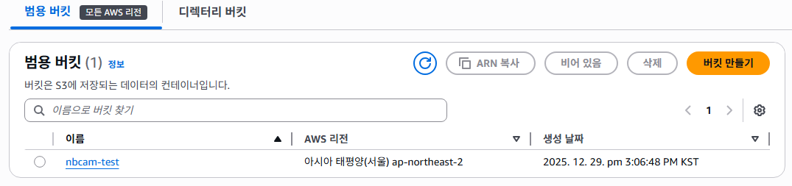
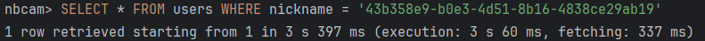

# AWS 설정 화면

## RDS



## EC2



## S3



## Health Check API

서버 상태를 확인할 수 있는 Health Check API입니다. 이 API는 누구나 접속 가능하며, 서버의 라이브 상태를 확인할 수 있습니다.

### API Path

- **Path**: `/health`
- **Method**: `GET`

### Response 예시

- 서버가 정상적으로 실행 중인 경우:
  ```text
  OK
  ```

## 닉네임 조회 시간

### 기본 조회 시간


3s 60ms 소요

### 인덱스 설정


7ms 소요

### redis 설정

redis 캐싱 적용하여 캐시에 있는 유저 데이터 조회시 1ms 이내로 조회 가능